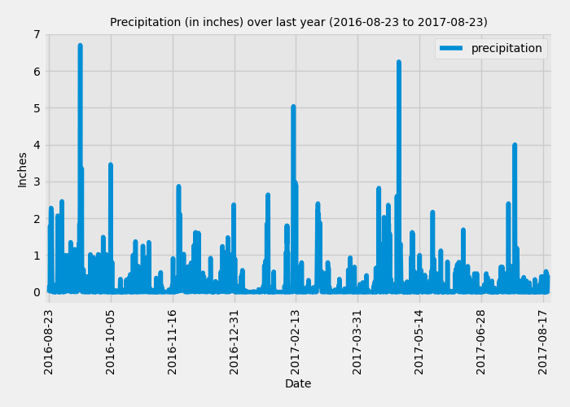
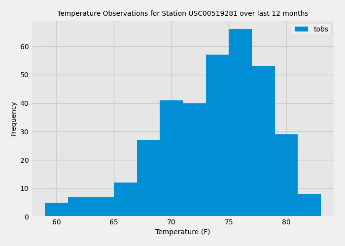

# SurfsUP - Climate Data Analysis and Climate API app

This challenge is completed as requirement of Data Analytics Boot Camp at University of Toronto.

The project analyzes the Climate and Station data for holiday destination of Honolulu, Hawaii in order to plan a vacation. The project performs climate analysis about the area by exploring climate data and creating an app.

## Part 1: Analyze and Explore the Climate Data

This section of the project uses Python and SQLALchemy to do a basic climate analysis and data exploration of the SQLite climate database by using ORM queries, Pandas and Matplotlib. This is achieved by using SQLAlchemy functions of create_engine() and automap_base() to connect to the database and reflect the tables into classes respectively. There are two classes in this database named 'station' and 'measurement'. The data is then explored by creating session, performing queries and then closing the session.

### *Precipitation Analysis:*

The first part of the analysis includes precipitation data. This includes the following steps:

1. Finding the most recent date in the dataset.

2. Getting previous 12 months of precipitation data using the most recent date by performing query.

3. Loading the query results into a Pandas DataFrame and setting index to 'date' column and sorting it.

4. Plotting the results using 'plot' method which creates the following chart:

5. Using Pandas to print the summary statistics for the precipitation data.

### *Station Analysis:*

The second part of the analysis includes station data. This includes the following steps:

1. Calculating the total number of stations in the dataset.

2. Finding the most activae station by designing a query which counts the rows for each station, lists the stations and observation counts in descending order and odentifies the station with the greatest number of observations.

3. Query the data to find the lowest, highest and average temperature for the most active station.

4. Retrieving the previous 12 months of temperature observation (TOBS) data for the most active station.

5. Plotting the results as a histogram with 12 bins which creates the following chart:

The session is closed after performing the above climate analysis.

## Part 2: Design the Climate App

This section of the project designs a Flask API based on the queries and analyses peformed in Part 1. The following routes are created using Flask:

1. /
    This is the homepage and lists all available API routes.

2. /api/v1.0/precipitation
    This route performs a query and returns JSON representation of a dictionary of the precipitation data for the last 12 months using 'date' as the key and 'prcp' as the value.

3. /api/v1.0/stations
    This route performs a query and returns a JSON list of all stations from the dataset.

4. /api/v1.0/tobs
    This route performs a query and returns a JSON list of dictionary containing dates and remperature observations for the previous year of the most activate station (USC00519281).

5. /api/v1.0/<start>
    This route performs a query and returns a JSON list of dictionary containing date, minimum temperature, maximum temperature and average remperature data for all the dates greater than or equal to the start date. The start date is accpeted in the formart YYYY-MM-DD as a parameter from the URL.

6. /api/v1.0/<start>/<end>
    This route performs a query and returns a JSON list of dictionary containing date, minimum temperature, maximum temperature and average remperature data for all the dates from the start date to the end date, inclusive. The start date and end date are accpeted in the formart YYYY-MM-DD/YYYY-MM-DD as parameters from the URL.

